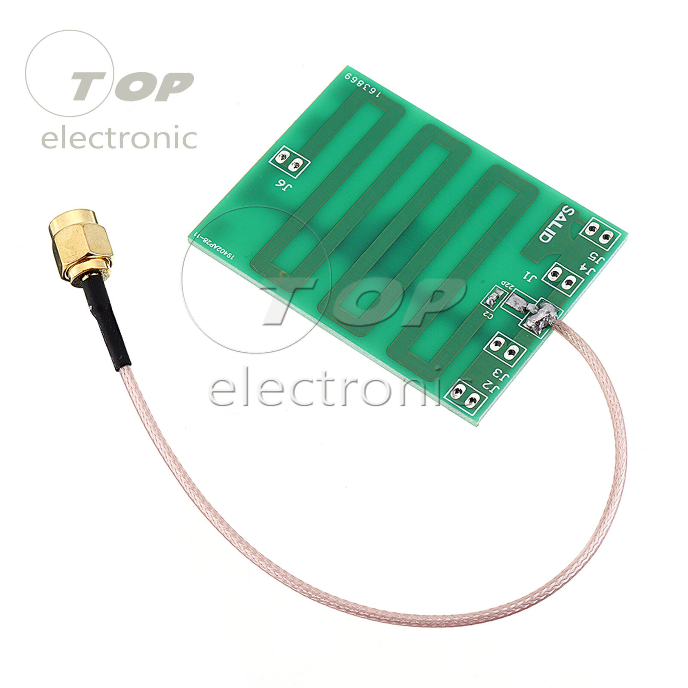

# RaceDB QLMUX Quick Start
## Overview

How to use the [racedb\_qlmuxd](git@github.com:stuartlynne/racedb_qlmuxd.git) Git archive
to quickly get RaceDB using an *Impinj* RFID reader and Brother QL Label Printers.

1. Clone 
2. Review Docker Configuration
3. Review QLMUXD Configuration
4. Create racedb\_qlmux container set
5. Verify containers running in portainer
6. Verify RaceDB available 
7. Import json data


## Prerequisites
1. Linux running in Laptop
2. Impinj R1000 or R420 RFID Reader
3. One or more Antenna Wands
4. One or more QL710W for printing frame plate labels
5. One or more QL1060N for printing BIB numbers
6. Optional copy of exported Racedb.json data
7. One or more Windows, Mac or Chromebook laptops for registration stations
8. Small WiFi Router with 4-port Ethernet switch


## Clone Archive
```
git clone https://github.com/stuartlynne/racedb_qlmux
```

## Network Setup

Personal preference, but I prefer static IP addresses for everything:

- WiFi SSID - racedb
- Network 
    - 192.168.40/24 - laptops, printers, router
    - 10/8 - Impinj RFID Readers

I setup the Impinj RFID readers with a 10.NN.NN.NN address so that they can be easily 
swapped. The NN.NN.NN is the decimal equivalent of the last three hex numbers of the
reader's MAC address.

```
    MAC  00:16:25:10:15:70
    IPv4 10.16.21.112
```

Both Windows and Linux allow for setting the network correctly:

- IP Address: 192.168.40.40
- Mask: 255.255.255.0
- Gateway: 192.168.40.254

- Additional IP Address: 10.0.0.40
- Additional IP Mask: 255.0.0.0


## Linux

Install recent Linux (e.g. Mint) on your laptop. You will need git, docker and portainer installed.

See also: [Linux setup](README-Linux-prep.md)


## Review Docker Configuration

Options:
    - 8080 or 8081 server port
    - static IP address of the RFID Reader
    - transmit power setting for RFID Reader when using your Antenna Wands
    - receiver sensitivity setting for RFID Reader when using your Antenna Wands


### docker.env
```
CONTAINER_YML_LIST=(  
    ./postgresql/docker-compose.yml 
    ./racedb/docker-compose.yml 
    #./qlmux_proxy/docker-compose.yml
    #./traefik/docker-compose.yml
    )

# This is for:
#   - access to an Impinj reader via the qlmux_proxy
#   - Impinj R1000 with Lilly 5dBi PCB UHF RFID Patch antenna wands
#
export RFID_READER_HOST=127.0.0.1
export RFID_TRANSMIT_POWER=40
export RFID_RECEIVER_SENSITIVITY=20


## Review QLMUXD Configuration

The QLMuxd system routes label printing to the available label printers. It 
will try and print on the primary printer for a registration station. But can
route to a backup if the printer is not available (typically out of labels o
jammed.)

Set the configuration for the QL printers. 

    - list the printers with model, port and static IP address
    - define the printer pools that will capture the label data and where to send it

This is for two small and one large printer. Suitable for up to two or three 
registration stations that are not busy.

It is possible to setup four small and two large. That is able to handle
four registrations stations that are busy.

### qllabels-qlmuxd/qlmuxd.cfg
```
// QLMuxd configuration
//
{
// These are the pool listen ports
//
QLMux_Ports: [9101, 9102, 9103, 9104],

// These are the printer destinations
// name: hostname or ip address of printer
// model: model name printer reports via SNMP iso.3.6.1.2.1.25.3.2.1.3.1
QLMux_Printers: [
     {name:"ql710w8",  hostname:"192.168.40.44", model:"Brother QL-710W",  port:9100},
     {name:"ql710w7",  hostname:"192.168.40.43", model:"Brother QL-710W",  port:9100},
     {name:"ql1060n1", hostname:"192.168.40.45", model:"Brother QL-1060N", port:9100},
],

// These are the printer pools.
// Pools map jobs directed at the listen port to the primary printers 
// or if necessary the backup printers.
// 
// name: pool name
// listen: port to listen on for this pool
// media: match against what printer will report via SNMP iso.3.6.1.2.1.43.8.2.1.12.1.1
// primary: list of printers in pool
// backup: list of printers to use if no primary printers are available
//
QLMux_Pools: [
    {name:"small1", listen:9101, media:["62mm x 100mm",  "62mm x 100mm / 2.4\" x 3.9\"",], primaries:["ql710w8", ], backups:["ql710w7", ],},
    {name:"small2", listen:9102, media:["62mm x 100mm",  "62mm x 100mm / 2.4\" x 3.9\"",], primaries:["ql710w7", ], backups:["ql710w8", ],},
    {name:"large1", listen:9103, media:["102mm x 152mm", "102mm x 152mm / 4\" x 6\"",   ], primaries:["ql1060n1",], backups:[ ],},
],

// This is the status port
//
QLMux_StatusPorts: [
    {name: "snmp", port: 9100 },
],
}

```

## Create racedb\_qlmux container set

```
sudo ./primary start
```

## Verify containers running in portainer


## Verify RaceDB available 
## Import json data


## Lilly 5dBi PCB UHF RFID 902-928M Antenna 5cm\*5cm with SMA Connector IC TOP



Widely available on ebay and aliexpress. Roughly $6-$10 depending on wiring. 
These work well to assemble into an antenna wand.

We attach them to a 5" metal paint scraper using doubled sided tape. Attach
a 2m cable with correct connectors for the Impinj and the purchased version.

Cover with electrical tape. Optionally use Dip-It to waterproof. Assembled
cost is generally $20 depending on the cost of the 2m cable.

